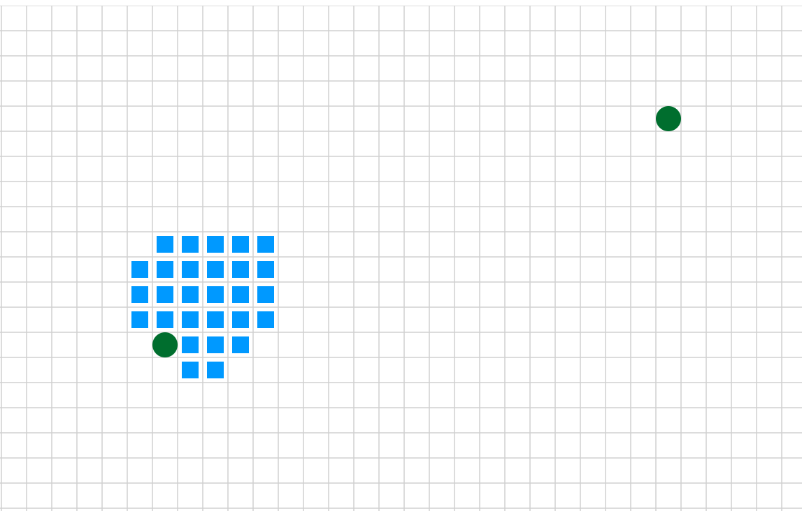
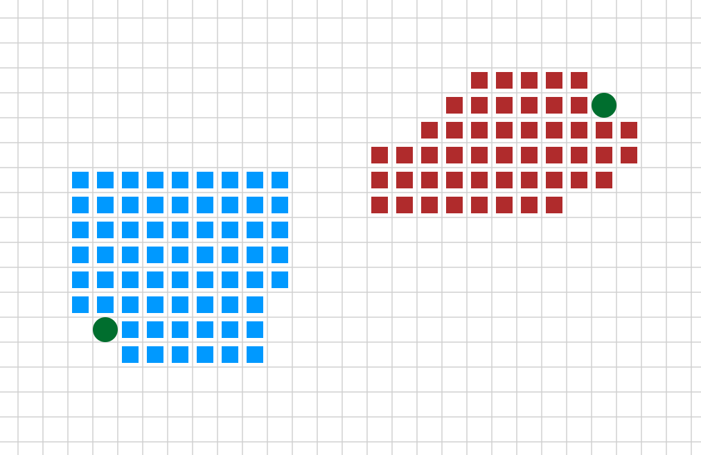
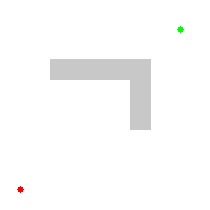
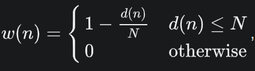
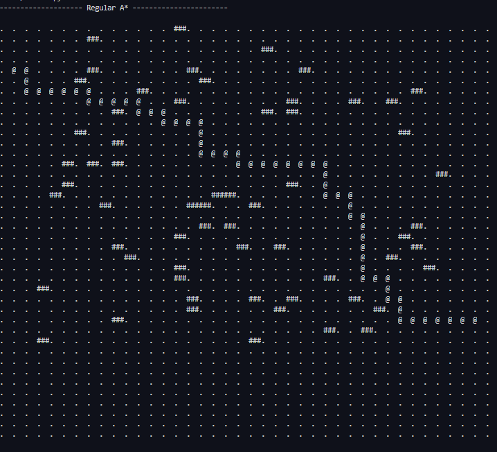
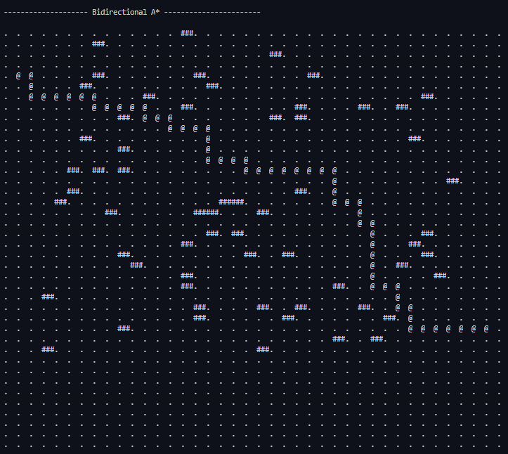
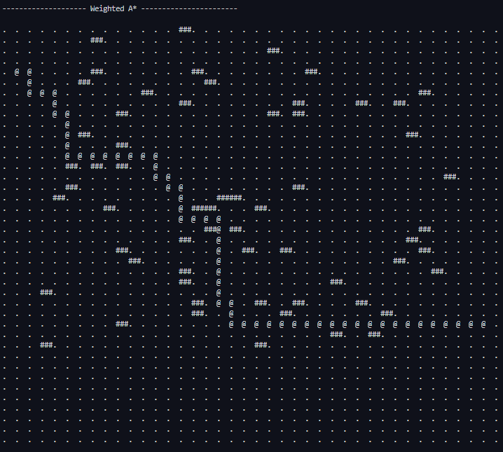

# A-Star Pathfinding Algoirthm & Variations 
This repository is part of my work for the Melbourne Space Program. In this repository I have implemented variations of the a-start pathfinding algorithm. The purpose is to compare efficiency metrics and have a code base variations.

# Compared Algorithms 
    1. Base A-Star 
    2. Simple Bidirectional A-Star 
    3. Weighted A*
    4. Dynamic Weighted A*  


### Bidirectional A-Star 
Instead of searching from the start to the finish, we can start two searches in parallel―one from start to finish, and one from finish to start. When they meet, or the any of the searches reach their target we get a path. 

Uni-directional A*          |      Bidirectional A*
--------------------|---------------------
   | 


Time complexity:
- Regular A*: O(b<sup>d</sup>)
- Bidirectional A*: O(b<sup>d/2</sup>)

Here **b** is the branching factor and **d** is distance of goal vertex from source 

Research Paper: https://arxiv.org/pdf/1703.03868.pdf


### Weighted A* 
With Weighted A* we are making a tradeoff between optimal path and speed. We add a bias towards finding the goal hence the target finding procedure is speed up. However, Weighted A* does not provide the most optimal map. 

Instead of calculating 
    Regular A* => cost = g(n) + h(n)
    Weighted A* =? cost = g(n) + w * h(n)
Formal of defining this.  
    Heuristic calculation, h(w) = h(n) = ε h(n) where ε > 1

Regular A*          |        Weighted A*
--------------------|---------------------
   | 


As we can see the weighted A* algorithm explores a lower number of nodes and finds our goal quicker. 


Further info: 
- [Stack Overflow](https://stackoverflow.com/questions/44274729/a-search-advantages-of-dynamic-weighting)
- Wikipedia -- [Bounded Relaxation for the A* Search Algorithm](https://en.wikipedia.org/wiki/A*_search_algorithm#/media/File:Astar_progress_animation.gif)


### Dynamic Weighted A* 

Instead of having a static weight for the cost calculation we dynamically calculate the cost function. The feature of this variant is at the start we have a high bias towards finding the goal but as we get deeper into our search we gradually revert to our regular A* algorithm. 


The cost function calculation: 
f(n) = g(n) + (1 + ε * w(n)) * h(n) where, 



Here, 

**d(n)** = Depth of search. For my implementation I used a 2D grid hence level of nodes is the depth. For example the neighbors of starting node has a d(n) = 1 and the neighbors of neighbor of starting node has a d(n) = 2

**N** = The estimated distance of the path. For my implementation the highest path can be the range of the sensor for the rover. I assumed a dummy value of 100 nodes as the range of my robot. 


**Note:** I have not extensively tested Dynamic weighted approach and have not found any proper code implementation which I can compare it with. Hence, please take the performance of this with caution. 


Research Paper: https://www.cs.auckland.ac.nz/courses/compsci709s2c/resources/Mike.d/Pohl1973WeightedAStar.pdf


# Implemented Heuristics 

Name of Heuristic | Equation of Heuristic 
------------------|----------------------
Euclidean Distance | h(n) = sqrt( (x<sub>goal</sub> - x)<sup>2</sup> + (y<sub>goal</sub> - y)<sup>2</sup> )
Manhattan Distance | h(n) = abs((x<sub>goal</sub> - x)) + abs((y<sub>goal</sub> - y))
Diagonal Distance | h(n) = max(abs((x<sub>goal</sub> - x)), abs((y<sub>goal</sub> - y)))

 

# Running instructions 

To see the output of different functions simply run 

```python3 
python tester.py
```


Here are some sample outputs of different algorithms run on the same diagram: 








### Different Diagrams 
There are 4 different diagram choices available named diagram1 .... digram4 
You can select the diagram of your choice 

```
grid = diagram[You choice of diagram no.]
```

You should also make sure the start and goal coordinates are valid as different dimensions. The diagrams can be found in '/maze/diagrams.py'

``` 
start, goal = (x, y), (u, v)
```
The diagrams also vary on the weight of each cell as well as wall configuration. 


**Note**: Any kind contribution is welcome. Please feel free to open a pull request and I will review it as soon as possible.  