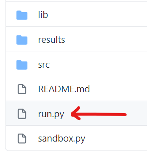

# Path Finding Algorithm Comparison Platform

## Introduction 
This is software platform aimed at comparing the relative performance of various path planning/route finding algorithms. This software tool benchmarks the processing time, peak memory usage and distance of the path found and presents them in a visual manner. We have designed our path finding software in such a way so easily a range of different algorithms can be added to the platform and their performance can be benchmarked.

Currently in the repository there are three classes of pathfinding algorithms are present as default:
1. A* and variants (Heuristic based family) 
2. Pledge (Wall follower family)
3. RRT and variants (Probabilistic family) 


## Usage 

Our goal is to create a scalable easy to use function. To use the comparison platform you simply need to: 

1. Import your algorithm(s) into the comparison platform 
2. Select it inside the `run.py` file 

### 1. Importing your Algorithm(s)

**Step 1:** You can import the file or folder of the algorithm inside the lib folder. 


**Step 2:** Ensure you have fixed any relative imports inside your files. This step is only applicable if you have multiple files are they're importing functions/classes from each other. 


Because our a-star variant file imports a class from a-star and both are under the lib folder, we import in the manner shown in the image above. 

**Step 3:** Write a wrapper class (If applicable). Currently the comparison platform is designed in a way that all functions accept 3 arguments in the order: 
1. List of obstacles (A list of (x, y) tuples)
2. A starting coordinate (A (x, y) format tuple)
3. A goal coordinate (A (x, y) format tuple)

If your algorithm accepts other out formats, you can call the main algorithm with all the necessary arguments inside the wrapper function. 


We have put together a very [short guide](wrapper.md) on writing the wrapper functions and you can find [here](wrapper.md). It has a template code for you to get started as well. 

### 2. Configure `run.py` 

**Step 4:** Import algorithm or wrapper function in the `run.py` file. 




Importing the files should be done as the following (Remember to do relative importing): 


**Step 5:** List your algorithm / wrapper function in the algorithm list. 


**Step 6:** Run `run.py` file. After completing the easy steps above simply run the following command: 

```python
python run.py 
```

You can also select the number of times the functions will be tested. For example:  

```python
python run.py 10 
```

**Step 7 (Optional):** Configure how dense you want the environment to be. 


### Check algorithm is working correctly 

Even if no errors are thrown during runtime, you should check the results folder. In the results folder a visual map (PDF file) with the planned route should be automatically generated with the name of your algorithm/wrapper function. Please review this figure and see if everything is okay. 

You can also check the CSV generated inside the results folder to cross check things. 


## Output 

The main power of this comparison platform lies within the extensive results it generated. The comparison platform gives you visualization of the following key performance factors: 
- Runtime 
- Memory Comparison 
- Average path length 


Upon running the program you should see a couple of figures which give you a visual comparison of the algorithms key metrics.


Furthermore inside the results folder you can also view the map of the environment and the path generated by each of the algorithms in separate PDF file. Sample:


You have also have access to the raw numbers inside a CSV file inside the results folder. 

