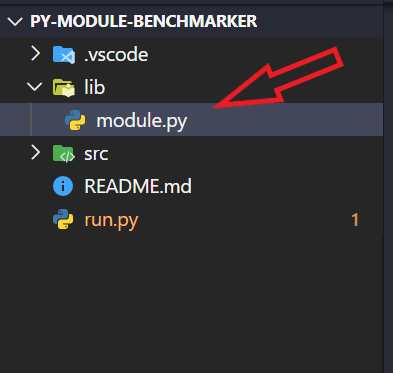
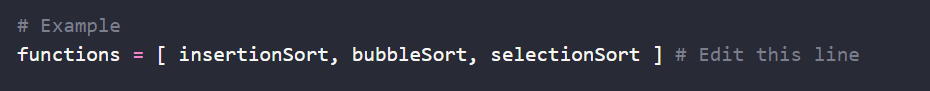

# py-module-benchmark
This is a benchmarking utility tool to measure relative time and memory performance of python functions and programs in **3 easy steps**.

The goal of this tool is to provide an easy to use and general purpose program to determine the runtime and peak memory usage. The tool is built on the standard library to keep it lightweight and hassle free. So, researchers and developers can run the program **without installing any additional libraries**.  

# How to use 
The program can be run in these 3 easy steps 

1. Load your code 
2. Choose function or modules to benchmark 
3. Run the benchmark 

### Loading your code 
**Step 1:**  Clone the py-module-benchmark repository into your local device. 


**Step 2:**  Copy the you code under the lib folder. If you just have a function you can put it into the 'module.py' file.



**Step 3:**  If you have put your own file copied into the lib folder, import them into the run folder. For example if I had a file named 'a_star.py' I would insert:


The code importing is very straight forward. The structure of the file import should be:  
```python
from lib.[file_name] import * 
```

or if it's under a folder:
```python
from lib.[folder].[file_name] import *
```

### Choosing function or modules 

**Step 4:** Select the functions you want to benchmark in 'run.py' file. 



Note: 
- Just write the name of functions, without the ()
- Write the name of the functions inside the list 

**Step 5:** Define the arguments of selected functions inside 'run.py' file. 


Note:
- The argument(s) need to be in the same order as functions were listed 
- Each argument would be inside a list 


### Running the Benchmark 

**Step 6:** To benchmark, run 'run.py' file 
```python
python run.py
```

#### Configuring iterations 
The default program is configured to run each function around 500 times randomly. Hence it might take a few seconds to run the program. However, if you program is too large or you have lots of functions to compare the benchmark can slow down significantly. Hence, the option to define the **number of iterations** can also be specified. 

You can specify the number of iterations in the terminal. 
```python 
python run.py 10
```

**Important:** It is highly advised that you don't go under 10 iterations to avoid any internal biases. 


After running you would see an output printed on Command Line/Terminal like this. 


# Additional Notes 

- The runtime of the functions is not absolute because we also running functions to track the memory. Although The runtime indication is reliable, this program is not suitable for approximate measurement of a function. 

- The memory tracked here is peak memory usage during the runtime, not the total memory use.

- This program may not be suitable for experiments related to Machine Learning weights or biases. If you want to track the performance of different hyper parameters, check out this website: 
    https://www.wandb.com/


